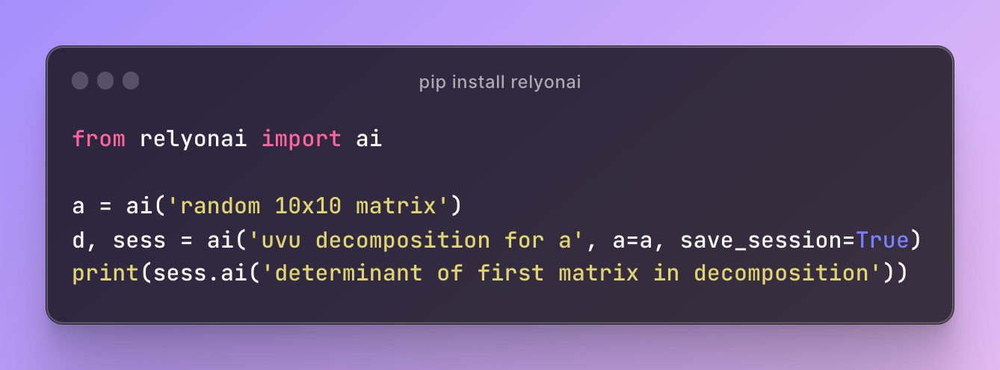

# relyonai



Python Runtime **Inline** AI Calls
- 🤖 AI language extension.
- 📉 Reduces code size.
- 🐍 Can use python runtime objects.
- 💿 Caches calls, so it's fast on re-runing.
- ✅ Fixes mistakes internallly.
- 🎁 Saves runtime context for reusing.
- ⭐️ Uses [Few-Shot](https://www.promptingguide.ai/techniques/fewshot) and [COT](https://www.promptingguide.ai/techniques/cot) under the hood.

> **Warning**  
> Halted till GPT-4 is publicly accessible (see [Reflections](#reflections)).

## Usage

```bash
pip install relyonai
export OPENAI_API_KEY=...
```

```python
from relyonai import ai
f = ai('get print hello world func')
f()
```

```python
from relyonai import config
config.model = 'gpt-4'
config.clear_cache()
```

## Reflections

Although the idea is working to some extent, it remains largely impractical for the time being. It falls short in a few crucial areas:
- **Reliability** and **Consistency**: The code that's being generated is not consistently accurate, with minor prompt modifications often leading to significant changes.
- **Controllability**: GPT-3.5, which was the primary model for the development of **0.1**, practically ignores system messages and often fails to follow few-shot examples, even for simple calls.
- **Privacy** and **Security**: This conserns could be largely mitigated by clever prompting and potentially runtime sandboxing (like patching Python's `open` call or something similar).

GPT-4 is expected to be a major leap over all axes with usable clever system messages and better Few-Shot/COT, but it needs to become publicly accessible, approximately 5x cheaper and roughly 2x faster to be practical for this task.

## 0.2 Plans

> **Note**  
> this is a rough draft

- [ ] improve quality
  - [ ] gpt-4: new system prompt and better cot
  - [ ] more tests + add reliability tests
  - [ ] include invocation context (`ai`, ±5 above/below exprs)
  - [ ] include project info / files / pip / hardware / os / time / etc.
  - [ ] final result check
  - [ ] different prompt for different py versions
  - [ ] other runtimes: bash, remote, c++, browser, etc.
  - [ ] bootstrap the package itlsef (just for the fun of it)
- [ ] better introspection
  - [ ] `rich` dialogue printing (+spinner)
  - [ ] much better error handling
  - [ ] view source code/doc
  - [ ] more granular sessions (trees)
- [ ] advanced caching
  - [ ] redis
  - [ ] limit size (up to ~20mb)
  - [ ] save pre-compiled code
- [ ] async
  - [ ] aai
  - [ ] agpt
  - [ ] aemb

## License

[MIT](LICENSE)
